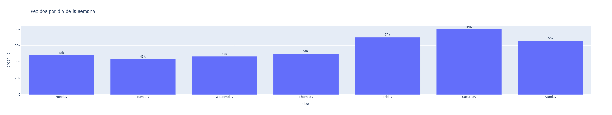
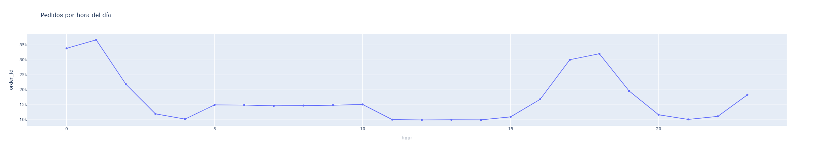
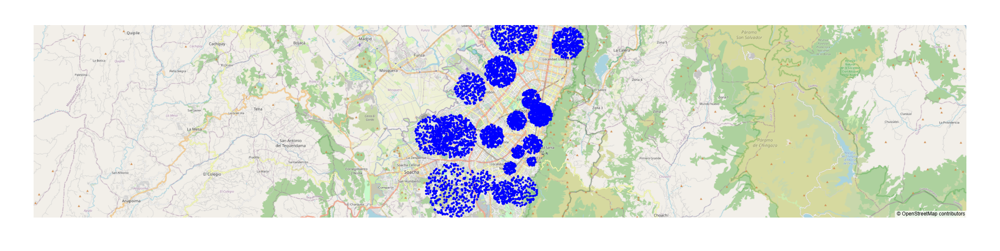

# 📊 Reporte Exploratorio de Datos (EDA) — RapiGo Demand Forecast

## 1. Objetivo
Explorar el dataset sintético de pedidos en Bogotá (1 mes, ~400k pedidos) para validar su coherencia y utilidad en modelos de predicción de demanda.

---

## 2. Hallazgos principales

### ⏰ Estacionalidad horaria
- Dos picos claros de pedidos: **almuerzo (11:30–14:30)** y **cena (18:00–21:30)**.
- Horas valle en la madrugada (00:00–06:00).

### 📅 Estacionalidad semanal
- **Viernes a domingo** concentran más pedidos (+30% vs. lunes/martes).
- Lunes es el día más flojo.

### 📆 Estacionalidad diaria
- Promedio de **12k pedidos/día**.
- Variación coherente entre días de semana y fines de semana.

### 🌎 Localidades
- Top 3: **Suba, Kennedy, Chapinero** → concentran gran parte de la demanda.
- Localidades periféricas (ej. Sumapaz) tienen muy pocos pedidos, como era de esperarse.

---

## 3. Visualizaciones

📈 **Pedidos diarios (serie temporal)**  

⏰ **Pedidos por hora del día**  

🗺️ **Mapa de pedidos (muestra 5k)**  

*(Las imágenes fueron exportadas desde los gráficos interactivos de Plotly.)*

---

